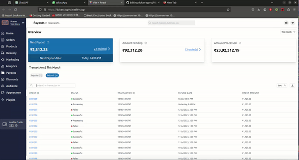

# Dukan App FrontEnd

This project is the frontend implementation of the UI design shared by Dukan Company's CTO, Shubash Choudhary, on [Twitter](https://twitter.com/subhashchy/status/1744308069751025894?t=MrLV-PSnfsgv0Hg2jTz5JA&s=08). The Dukan App FrontEnd is designed to provide a comprehensive dashboard for tracking transactions, revenue, and payout details efficiently.

## Features

- Responsive Dashboard with a modern UI.

## Technologies and Tools

- **React:** Utilized for building the user interface.
- **Vite:** Used for a faster and leaner development experience.
- **Tailwind CSS:** For styling and responsive design.
- **Recoil:** State management library used for managing global state across components.

## Setup and Installation

To run this project locally, follow these steps:

1. Clone the repository:
   ```bash
   git clone <repository-url>
   ```
2. Install dependencies:
   ```bash
   npm install
   ```
3. Start the development server:
   ```bash
   npm run dev
   ```
   The application will be available at `http://localhost:5176`.

## Live Link

[dukan-app-ui](https://dukan-app-ui.netlify.app/)


## Preview

[Dukan App FrontEnd Preview](https://youtu.be/mmdieewTAAk)


## Dukan-Frontend

 
